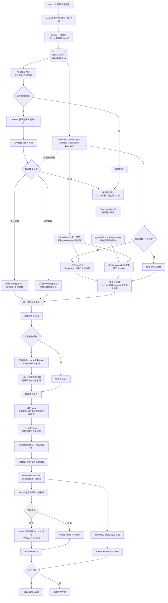

# 当前字幕管线与技术选型

本文描述截至 2026-08-19 的实际实现。配置以 `config.toml` 与
`src/subtitle_pipeline/config.py` 为准；实验计划见
[音频管线内存与并行优化](audio-pipeline-optimization.md)。

## 1. 下载与音频承载

`yt-dlp` 下载视频及 `source.info.json`。当前格式顺序优先 VP9，其次 H.264，原因是
RTX 2080 Ti 可以硬解这两种编码，但不能硬解 AV1。已经存在的源视频会直接复用。

进入语音阶段后，ffmpeg 将完整音轨一次性解码成 16 kHz、单声道、`float32` PCM。
`AudioBufferPool` 把它放入共享 CPU 内存；pyannote、Qwen、DiCoW 和声纹 worker
通过描述符或 NumPy 切片读取同一份数据，正常运行不为每个区间反复写临时 WAV。

Demucs `htdemucs` 是例外：歌曲分离需要较高质量的音频，因此只对 AST 提出的歌曲候选区间按需
读取源音频并提取人声，而不是将整部高采样率立体声音频常驻内存。

## 2. 音频分析

### 2.1 说话人时间轴

当前模型为 `pyannote/speaker-diarization-community-1`，一次推理产生两条时间轴：

- **ordinary diarization**：保留真实重叠以及重叠中的匿名 speaker，用于重叠检测、
  身份聚合和 DiCoW 掩码。
- **exclusive diarization**：每个时刻只保留一个主 speaker，用于普通 Qwen 讲话窗口和
  词素归属，避免轻微换人边缘把一句话机械切碎。

当前 `initial_analysis_concurrency = 2`，所以 pyannote 与原音 AST 并行运行。

### 2.2 人物身份

匿名 speaker 使用 `iic/speech_eres2netv2_sv_zh-cn_16k-common` 提取 embedding，和
`work/speaker-profiles-eres2netv2/` 中的五位梦限大成员声纹比较余弦距离。

声纹库保留独播中的多条干净样本，并为每人建立最多 5 个聚类中心，而不是把所有状态
压成一个平均 embedding。身份判断汇总同一匿名 speaker 的非歌唱、非重叠片段，删除
距离 medoid 最远的 15%，再按片段时长加权。不同匿名标签可以映射到同一人物，不执行
强制一对一分配；证据不足时保持匿名并使用默认字幕样式。

### 2.3 歌曲分流

歌曲分流的核心模型是 `MIT/ast-finetuned-audioset-10-10-0.4593`。它是 AudioSet
音频事件分类器，并非专用歌曲边界模型。

当前算法为：

1. 原音按 5 秒窗口、2.5 秒步长运行 AST。
2. 分别保留歌唱、讲话和音乐三类证据。speech 不再从 singing 中相减，因此 call 和带
   讲话特征的歌唱不会因为 speech 分数较高而直接归零。
3. 对连续 3 个窗口分别取中位数。稳定 singing 证据会建立歌唱锚点；当原始 singing
   已超过阈值且同时存在音乐证据时，也允许保留被中位数滤掉的短歌唱锚点。
4. 只有歌唱锚点能进入歌曲状态。单纯“讲话 + BGM”不能自行建立歌曲，避免整场直播因
   背景音乐被送入歌声路径。
5. 进入歌曲状态后，音乐证据负责覆盖 call、间奏和短暂讲话；只有新的歌唱锚点会刷新
   35 秒 release。若最后一个锚点后出现明确的普通讲话接管，终点回填到讲话开始处。
6. Demucs `htdemucs` 提取候选区间的人声轨，再次运行 AST，以 `0.5` 阈值确认实际
   歌唱。有人声轨歌唱锚点的短歌也可以确认，不再仅因不足 30 秒而丢弃。
7. 仲裁后输出 `speech`、`singing` 或 `ambiguous`。歌曲区间内有声音的人声片段走句级
   Qwen 歌曲路径，纯间奏不生成字幕，不会切回普通 Forced Aligner。

这里的 `singing` 表示“歌曲表演区间”，不是“当前 5 秒全部在唱”。状态机每个窗口的
singing、speech、music 分数、状态和转换原因都会写入 `audio-analysis.json` 的
`song_detection` 字段，便于复核边界。2026-08-17 的两个失败样例用于真实回归：歌枠
约 `06:40–10:42.5` 被识别为一个连续区间，内部 call 不再切断；开头自我介绍歌也能从
`00:00` 进入歌曲路径。

## 3. 三条 ASR 路径

### 3.1 普通讲话：Qwen + Forced Aligner

相邻讲话区间在间隔不超过 2 秒时合并。窗口目标约 60 秒，允许根据自然边界延长，硬上限
90 秒；窗口中最多允许 15 秒静音且语音覆盖率至少为 60%。前后各附带 2 秒上下文，只有
核心区间的词素归属于该窗口。

当前固定批量大小为 4。`Qwen/Qwen3-ASR-1.7B` 负责日文文本，
`Qwen/Qwen3-ForcedAligner-0.6B` 只对 **Qwen 文本**产生细粒度时间轴，不处理 DiCoW
文本。词素 speaker 取 diarization 时间交集最大的已知人物；最低覆盖率为 35%，边界
不足时额外使用 0.1 秒容差。

本地检查非单调时间、相同起点坍缩、异常长词素、空结果和重复循环。异常窗口优先在已有
时间边界附近递归缩短，子窗口不能短于约 15 秒；仍不能得到可信时间轴时整条任务停止，
不会带着缺失字幕继续渲染。

### 3.2 长重叠：DiCoW

ordinary diarization 中真实同时讲话达到 `0.5` 秒时，管线把重叠前后各 2 秒的完整讲话
上下文交给固定 revision 的 `BUT-FIT/DiCoW_v3_3`。当前批量大小为 4，单窗口不能超过
30 秒。

DiCoW 输出按 speaker 分路的**段级**日文文本与时间，不经过 Qwen Forced Aligner。
管线保留同时间范围的 Qwen 混合文本和词素作为证据：

- DiCoW 正常时，用其分路结果替换相应 speaker 的局部 Qwen 基线。
- DiCoW 遗漏某个活跃 speaker 时，保留该 speaker 的 Qwen 基线。
- DiCoW 出现强重复循环时，丢弃异常结果并保留 Qwen 基线。
- 翻译 LLM 同时看到 Qwen 混合文本、DiCoW 分路文本和 diarization 活动区间，用于修正
  明显文本幻觉，但不得伪造 speaker 或时间范围。

当前 DiCoW worker 尚未启用 token timestamp，因此不能把其文本描述为词级对齐结果。

### 3.3 歌唱与模糊区域

确认歌唱区间使用 Qwen3-ASR 的无时间戳模式：12 秒窗口、2 秒重叠，通过文本重叠去重，
再将窗口拥有范围作为句级时间。歌声不进入 Forced Aligner，因为现有 aligner 在演唱、
伴奏和 call 上容易出现时间坍缩。

`ambiguous` 区域同时尝试普通讲话对齐和歌声句级转写，再根据时间轴健康度选择结果。
任何路径出现长重复循环都会被拒绝。

## 4. 歌名识别与歌词校正

歌曲分流解决“用哪条 ASR 路径”，歌曲识别解决“唱的是哪首歌”，两者不是同一阶段。

启用 `[song_identification]` 后，管线只在开唱前 30 秒至开唱后 15 秒附近每秒抽帧，使用
PaddleOCR 的 `PP-OCRv5_mobile_det` 与 `PP-OCRv5_server_rec` 提取稳定日英文字。
LLM 综合以下证据判断歌名：

- 画面 OCR；
- 开唱前后的报幕 ASR；
- YouTube 标题、简介和歌单；
- 原始歌唱 ASR 文本；
- `ddgs` 搜索与 `trafilatura` 提取的官方页面、音乐平台或歌词页面。

外部网页始终作为不可信证据，不允许其中的文字改变工具行为。中等置信度候选可以继续
匹配歌词，但只有 LLM 判断搜索歌词与实际 ASR 内容吻合时才校正歌词。单首识别失败只
保留原 ASR 并记录警告，不阻塞其他内容。

## 5. LLM 联合断句与翻译

所有时间单元统一表示为 `[id,duration_ms,gap_after_ms,speaker,kind,text]`。绝对时间只
保存在本地，LLM 只能选择连续的 `start_id`/`end_id` 并生成简体中文译文，不能生成或
修改时间戳。

### Map

- 每个初始窗口最多 600 个源单元。
- 最多 16 个窗口并行请求。
- LLM 同时决定视觉友好的 cue 边界和翻译，不再先机械断句再逐 cue 翻译。
- 每个多单元窗口必须产生至少两条 cue。
- 输出可为 JSON 对象、数组、NDJSON 或连续 JSON 对象，解析后执行同一套严格校验。
- 内容校验失败立即重试一次，随后递归缩小窗口；HTTP 429/5xx 不缩窗。

### Reduce

Map 窗口互不重叠，因此窗口边缘只是暂定边界。所有 Map 完成后，每对相邻窗口取左窗
最后一条和右窗第一条作为可写范围，再并行交给 LLM 重规划。外侧 cue 只提供上下文。
缩窗产生的新内部边界也执行同样的 Reduce，不把计算窗口边缘变成最终字幕边界。

### 定点修复与校验

ID 缺失、重复、越界、时间轴无效或严重超宽说明 cue 分区不可信，需要重做相应窗口。
空译文和日文假名残留等边界仍可信的问题先缓存为 `pending`；全部窗口完成后，把多个错误
cue 连同原文、speaker 和相邻字幕组成修复批次。模型只能按 `repair_id` 修改 `text`。

译文建议宽度按画幅、标准字号和安全边距计算。超过建议宽度但仍能放进整帧时允许保持
一行；超过整帧一行宽度但不超过两倍时，渲染阶段平衡成两行；超过整帧两倍宽度则拒绝。
任何 pending、ID 覆盖或时间轴错误都会阻止渲染与上传。

网络超时、连接错误、HTTP 429 和 5xx 使用带 jitter 的退避；429 优先遵守
`Retry-After`。HTTP 400、401、403 等非暂时性错误立即终止。本地内容校验失败不等待
退避。

## 6. 字幕、元数据与渲染

联合结果分别生成：

- `source.semantic.srt`：按最终 cue 边界恢复的日文审计字幕；
- `translated.zh-CN.srt`：简体中文字幕；
- `translated.metadata.json`：标题、简介、内容摘要、歌曲报告和 B 站标签。

相邻 cue 时间重叠时，前一条在后一条开始时立即结束。最终 cue 的人物取其中已知源单元
数量最多的人物，unknown 不参与多数计算；并列或全部 unknown 时使用默认白字样式。

字号按视频短边计算：横屏 6.6%，竖屏 7.7%，限制在 28–144。提示词安全边距为横屏左右
各 7.5%、竖屏各 2.5%，底边距为画面高度 5%；实际 ASS 左右边距统一为 1 px。描边为
短边的 0.3%。人物样式来自 `character_styles.json`，不会发给翻译 LLM。

渲染前删除每个显示行末普通逗号、句号、分号、冒号和顿号，但保留问号、感叹号和省略号；
该操作不修改审计 SRT。

`render.backend = "auto"` 优先使用原生 `ass-cuda-render`：libass 在 CPU 只生成字幕文字、
描边和阴影的小型位图，CUDA 将其混合到 NVDEC 帧，再交给 NVENC。输入编码或显卡不支持
时回退到 ffmpeg `libass + libx264`。最后由 ffmpeg 将原始音轨和元数据无损封装回成片。

## 7. 缓存与恢复

每个 URL 使用 SHA-256 前 12 位作为 `work/<job-id>/`。主要缓存如下：

| 文件 | 内容 | 恢复粒度 |
|---|---|---|
| `audio-analysis.json` | speech、singing、ambiguous、diarization | 整个分析签名 |
| `asr-analysis-cache.json` | 各讲话/歌唱区域及递归子范围结果 | 单窗口或子窗口 |
| `conditioned-asr-cache.json` | DiCoW 重叠分路结果 | 全部重叠窗口签名 |
| `song-ocr-cache.json` | 每首歌的 OCR 候选 | 歌曲集合签名 |
| `song-identification-cache.json` | 歌名、来源与歌词对齐报告 | 歌曲集合签名 |
| `cue-translation-cache.json` | Map、Reduce、最终记录与 pending 修复 | 单窗、单边界、单 repair ID |
| `manifest.json` | 最终产物与上传完成状态 | 整个作业 |

缓存签名包含相关模型、配置、源时间轴和提示词版本。签名变化时不会误用旧结果；成功结果
使用临时文件原子替换，中断后只补未完成部分。共享内存只用于当前进程生命周期，不属于
持久缓存，退出时由所有者 `close()` 并 `unlink()`。

## 8. 当前主要技术风险

1. **歌曲路由召回率**：通用 AudioSet AST 对 call、自我介绍歌和讲话特征明显的歌曲
   不够可靠，且当前差分打分与中位数平滑会进一步降低召回率。
2. **歌声时间轴粒度**：歌唱路径只有句级窗口时间，不提供可靠词级对齐。
3. **重叠语音文本**：DiCoW 能分 speaker，但目前只有段级时间；严重串音仍可能导致遗漏
   或幻觉，因此保留 Qwen 混合基线作为证据和回退。
4. **说话人身份域偏移**：ERes2NetV2 预训练域与日语 VTuber 直播并不完全一致，角色声、
   情绪变化、BGM 和压缩失真都会增大声纹距离。
5. **LLM 尾延迟**：少数窗口可能出现长输出、格式错误或内容校验失败；并发 Map、逐窗缓存、
   快速缩窗和定点修复降低了影响，但不能消除服务端波动。

## 9. 代码入口

- 总编排：`src/subtitle_pipeline/pipeline.py`
- 共享音频：`src/subtitle_pipeline/audio_buffer.py`
- 音频分析与歌曲分流：`src/subtitle_pipeline/audio_analysis.py`
- 声纹身份：`src/subtitle_pipeline/speakers.py`
- Qwen ASR 与 Forced Aligner：`src/subtitle_pipeline/asr.py`
- DiCoW 重叠修复：`src/subtitle_pipeline/conditioned_asr.py`
- 歌名识别：`src/subtitle_pipeline/song_identification.py`
- 联合断句与翻译：`src/subtitle_pipeline/translate.py`
- ASS 与视频渲染：`src/subtitle_pipeline/media.py`
- Bilibili 投稿：`src/subtitle_pipeline/upload.py`
