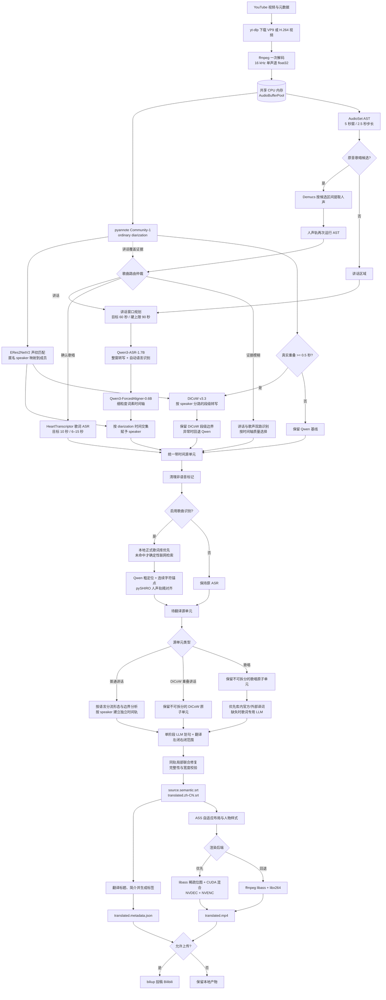

# 当前字幕管线与技术选型

本文描述截至 2026-08-23 的实际实现。配置以 `config.toml` 与
`src/subtitle_pipeline/config.py` 为准；实验计划见
[音频管线内存与并行优化](audio-pipeline-optimization.md)。

每次运行都会在任务目录写入 `performance.json`。其中 `stages` 保留各阶段及各批次的
墙钟耗时、状态和可获取的 PyTorch 峰值显存，`summary` 汇总同名阶段的调用次数、总耗时
和最大耗时；`pipeline.total` 是完整管线墙钟时间。报告使用临时文件原子替换，管线失败
或被中断时也会保留已完成阶段和错误原因。



## 1. 下载与音频承载

`yt-dlp` 下载视频及 `source.info.json`，DASH/HLS 默认并行下载 8 个分片。当前格式顺序优先 VP9，其次 H.264，原因是
RTX 2080 Ti 可以硬解这两种编码，但不能硬解 AV1。已经存在的源视频会直接复用。

进入语音阶段后，ffmpeg 将完整音轨一次性解码成 16 kHz、单声道、`float32` PCM。
`AudioBufferPool` 把它放入共享 CPU 内存；pyannote、Qwen、DiCoW 和声纹 worker
通过描述符或 NumPy 切片读取同一份数据，正常运行不为每个区间反复写临时 WAV。

Demucs `htdemucs` 是例外：歌曲分离需要较高质量的音频，因此只对 AST 提出的歌曲候选区间按需
读取源音频并提取人声，而不是将整部高采样率立体声音频常驻内存。

## 2. 音频分析

### 2.1 说话人时间轴

当前模型为 `pyannote/speaker-diarization-community-1`，管线只采用 ordinary 时间轴：

- **ordinary diarization**：保留真实重叠以及重叠中的匿名 speaker，用于普通 Qwen
  讲话窗口、词素人物归属、重叠检测和 DiCoW 掩码。
- 声纹身份阶段从每位 speaker 的 ordinary turn 中减去所有多人重叠交集，只将剩余的
  干净单人片段作为身份匹配骨架。exclusive 时间轴不再读取或参与任何决策。

当前 `initial_analysis_concurrency = 2`，所以 pyannote 与原音 AST 并行运行。

### 2.2 人物身份

匿名 speaker 使用 `iic/speech_eres2netv2_sv_zh-cn_16k-common` 提取 embedding，和
`work/speaker-profiles-eres2netv2/` 中的五位梦限大成员声纹比较余弦距离。

声纹库保留独播中的多条干净样本，并为每人建立最多 5 个聚类中心，而不是把所有状态
压成一个平均 embedding。身份判断汇总同一匿名 speaker 的非歌唱、非重叠片段，删除
距离 medoid 最远的 15%，再按片段时长加权。不同匿名标签可以映射到同一人物，不执行
强制一对一分配；证据不足时保持匿名并使用默认字幕样式。

### 2.3 歌曲分流

歌曲分流的核心模型是 `MIT/ast-finetuned-audioset-10-10-0.4593`。它是 AudioSet
音频事件分类器，并非专用歌曲边界模型。

当前算法为：

1. 原音按 5 秒窗口、2.5 秒步长运行 AST。
2. 分别保留歌唱、讲话和音乐三类证据。speech 不再从 singing 中相减，因此 call 和带
   讲话特征的歌唱不会因为 speech 分数较高而直接归零。
3. 对连续 3 个窗口分别取中位数。稳定 singing 证据会建立歌唱锚点；当原始 singing
   已超过阈值且同时存在音乐证据时，也允许保留被中位数滤掉的短歌唱锚点。
4. 只有歌唱锚点能进入歌曲状态。单纯“讲话 + BGM”不能自行建立歌曲，避免整场直播因
   背景音乐被送入歌声路径。
5. 进入歌曲状态后，音乐证据负责覆盖 call、间奏和短暂讲话；只有新的歌唱锚点会刷新
   35 秒 release。若最后一个锚点后出现明确的普通讲话接管，终点回填到讲话开始处。
6. Demucs `htdemucs` 提取候选区间的人声轨，再次运行 AST，以 `0.15` 阈值确认实际
   歌唱。有人声轨歌唱锚点的短歌也可以确认，不再仅因不足 30 秒而丢弃。
7. 仲裁后输出 `speech`、`singing` 或 `ambiguous`。歌曲区间内有声音的人声片段走句级
   Qwen 歌曲路径，纯间奏不生成字幕，不会切回普通 Forced Aligner。

这里的 `singing` 表示“歌曲表演区间”，不是“当前 5 秒全部在唱”。状态机每个窗口的
singing、speech、music 分数、状态和转换原因都会写入 `audio-analysis.json` 的
`song_detection` 字段，便于复核边界。2026-08-17 的两个失败样例用于真实回归：歌枠
约 `06:40–10:42.5` 被识别为一个连续区间，内部 call 不再切断；开头自我介绍歌也能从
`00:00` 进入歌曲路径。

## 3. 三条 ASR 路径

### 3.1 普通讲话：Qwen + Forced Aligner

相邻讲话区间在间隔不超过 2 秒时合并。窗口目标约 60 秒，允许根据自然边界延长，硬上限
90 秒；窗口中最多允许 15 秒静音且语音覆盖率至少为 60%。前后各附带 2 秒上下文，只有
核心区间的词素归属于该窗口。

当前固定批量大小为 4。`Qwen/Qwen3-ASR-1.7B` 不强制语言，自动识别并在每个 cue 和
对齐单元中记录 `Japanese`、`English` 或 `mixed`。
`Qwen/Qwen3-ForcedAligner-0.6B` 只对 **Qwen 文本**产生细粒度时间轴，不处理 DiCoW
文本。词素 speaker 首先按 ordinary diarization 的真实时间交集判断：单 speaker 的
交集至少覆盖词素时长 30% 时直接归属；同时与多个 speaker 相交时取总交集最大的一个。
这里不再扩张 diarization 边界，因此不会使用人工的 0.1 秒容差制造交集。

仍未归属的普通讲话词素在进入 LLM 前分层处理。短 unknown 段左右是同一 speaker 时
优先桥接；左右人物不同时，Sudachi 的词性/活用连接必须与 GiNZA 的依存关系和文节分析
共同指向同一侧，才执行 `grammar_left` 或 `grammar_right` 回填。最后仍无归属的词素交给
时间最近的 ordinary diarization speaker，距离不超过 0.5 秒时记为 `nearest_fallback`；
超过 0.5 秒则记为 `discarded`，不进入本地划句、LLM 或渲染。具名与匿名 speaker 都能
成为归属目标。

本地检查非单调时间、相同起点坍缩、异常长词素、空结果和重复循环。异常窗口优先在已有
时间边界附近递归缩短，子窗口不能短于约 15 秒；仍不能得到可信时间轴时整条任务停止，
不会带着缺失字幕继续渲染。

### 3.2 长重叠：DiCoW

ordinary diarization 中真实同时讲话达到 `0.5` 秒时，管线把重叠前后各 2 秒的完整讲话
上下文交给固定 revision 的 `BUT-FIT/DiCoW_v3_3`。当前批量大小为 4，单窗口不能超过
30 秒。

DiCoW 输出按 speaker 分路的**段级**日文文本与时间，不经过 Qwen Forced Aligner。
这些段落标记为 `conditioned_speech`，并作为联合翻译中的不可拆分原子单元：

- 在建立 DiCoW 窗口前，先将 ERes2NetV2 映射到同一人物的多个 pyannote 匿名标签合并为
  一条人物活动掩码；重叠判断和条件转写使用人物 ID，原匿名标签仅保留作审计。
- DiCoW 正常时，用其分路结果替换相应 speaker 的局部 Qwen 基线。
- DiCoW 遗漏某个活跃 speaker 时，保留该 speaker 的 Qwen 基线。
- DiCoW 出现强重复循环时，丢弃异常结果并保留 Qwen 基线。
- 正常 DiCoW 段直接进入联合翻译，翻译模型结合术语和相邻 cue 处理可能的误听，
  但不能合并或拆分 DiCoW 时间段。

当前 DiCoW worker 尚未启用 token timestamp，因此不能把其文本描述为词级对齐结果。

### 3.3 歌唱与模糊区域

确认歌唱区间先在 Demucs 人声轨上使用 HeartTranscriptor-oss 作粗转写。离线窗口目标为
10 秒，允许 6–15 秒并保留 1 秒重叠；在目标点前后 4 秒内依次优先选择 Demucs 人声轨的非歌唱
gap、平滑 RMS 能量谷值和 phrase 边界，没有证据时才硬切，同时重新平衡不足 6 秒的
尾窗。各窗口通过文本重叠去重，HeartTranscriptor 使用自动语言识别，不接收普通讲话的
context 或强制语言，以避免在模糊歌声或间奏中复述直播介绍。HeartTranscriptor 不负责
最终时间轴，Qwen Forced Aligner 也不处理歌唱；正式歌词命中后改由 pySHIRO 在持久化的
Demucs 人声候选轨上对不超过 20 秒的片段执行音素对齐。

`ambiguous` 区域同时尝试普通讲话对齐和歌声句级转写，再根据时间轴健康度选择结果。
任何路径出现长重复循环都会被拒绝。

## 4. 歌名识别与歌词校正

歌曲分流解决“用哪条 ASR 路径”，歌曲识别解决“唱的是哪首歌”，两者不是同一阶段。

启用 `[song_identification]` 后，管线先把歌唱 ASR 规范化为假名，在本地 SQLite 歌词库
中做字符级模糊匹配。只有多条连续锚点达到阈值才确认歌曲和演唱片段。未命中时根据稳定
OCR 和较长 ASR 片段生成搜索词，由独立 `ddgs` worker 搜索受支持歌词站；当前 UtaTen
适配器从结构化页面提取歌名、歌手和完整分行歌词，再用同一套本地匹配验证。

搜索和歌词匹配不调用 LLM。只有带外部来源、结构化完整正文且通过连续锚点验证的已发行
歌曲可以写入 `work/lyrics/library.sqlite3`；ASR 文本、call、ad-lib、喊声和搜不到的
未发行歌曲都不能写库。库中每首歌曲只保存一份完整标准歌词，视频只唱一部分时也不会
裁短库内正文。

匹配后使用 HeartTranscriptor ASR anchor 粗时间定位，在 Demucs 人声轨上切成不超过 20 秒的窗口，再由固定提交
的 pySHIRO 日文 v2 模型生成音素和歌词行时间。日文歌词直接使用官方读音或 Sudachi 读音；
英文歌词的官方拼写仍用于显示和翻译，仅在对齐请求中用 `alkana` 转成日式片假名发音。因为仍是
日语声学模型，这是对日本歌曲中英语唱法的近似对齐；词典无法转读的英文专名会放弃动态对齐，不伪造时间。
对齐审计同时保存歌词语言和隐藏读音。未匹配歌词的 call、ad-lib 和喊声被忽略；
句法上明确是普通讲话的片段会重新读取原始混音，用普通 Qwen + Forced Aligner 路径转写。

歌词定位采用半全局动态规划：完整使用按时间排列的歌唱 ASR，但允许免费跳过官方歌词的
开头和结尾，因此只唱副歌或歌曲中段时仍能定位。同一歌曲片段连续播放多遍时，匹配器会
反复提取时间上互不重叠的单调路径；每条路径是独立 take，可重新从完整歌词任意位置开始，
但一次 take 内不允许歌词倒序。ASR anchor 只作为高置信起点。路径内部跳过的歌词行，
以及相邻 take 之间上一轮的后继歌词和下一轮前缀，可以直接在 Demucs 人声轨上通过 pySHIRO
声学对齐补全，不再要求 ASR 再次听出歌词。内部缺口会比较仅含相邻锚点与加入缺失行两种
对齐的每帧似然；轮次边缘还会校验歌词密度、人声活动、时间覆盖和逐单元时长。只有绝对似然
合格、音素时长合理且时间轴单调时才补回缺失歌词。每次接受或拒绝及其证据均写入歌曲对齐审计。

译词优先级为同版本官方中文、已验证逐行外部翻译、歌词专用 LLM、本地机翻。缺失译词
通过专用提示词按完整歌曲逐行翻译并写回歌词库，记录模型、来源与日文歌词哈希。命中库内
译文的歌唱 cue 直接使用固定译文，不再进入通用对话翻译。

## 5. 本地分段与联合翻译

普通讲话完成上述归属后按 speaker 建立独立时间轨，不再为 unresolved unknown 建轨。
同一 speaker 的相邻发言间隔达到 2 秒会建立硬边界。这样 A 可以跨过 B 的短插话继续
组成一句，同时不同人物最终可以拥有相互重叠的字幕时间。

每个 episode 按语言路由分析。日语使用 SudachiPy `SplitMode.A` 补充词性、活用型和活用形，
并使用 GiNZA 依存证据回填 speaker；英语保留词间空格，使用英语标点、话语起始词和 spaCy
English tokenizer；混合语言保留原始空格，仅对日语字符片段运行 Sudachi，不把跨语言边界当作
日语语法连接。相邻 Forced Aligner 单元的候选边界累计评分：静音 120/250/400/600 ms
分别贡献 1/2/3/4 分；当前块达到 2 秒加 1，达到 4 秒再加 2；再叠加当前语言的终止、
起始和强连接证据。
总分达到 3 时贪心切分。若 6 秒仍没有切点，则从当前块 2 秒之后选择最高分边界，分数
相同取最靠后的一个。Qwen 标点不参与评分。

`local-segmentation.json` 保存每个词素的语言、speaker 归属原因、最近 speaker 距离、回填与
删除记录，以及每个边界候选的总分、命中因素、两侧形态证据、Nagisa POS 和最终
本地单元范围。Sudachi、GiNZA 或所需词典不可用时直接终止，不静默退化。

LLM 使用单阶段划句与翻译。每个请求覆盖一条 speaker 轨，输入为编号 `<CUE>`，
包含 speaker、language 和 ASR_TEXT。源文不回传，模型返回闭区间范围与译文：

```json
{"cues":[{"start_id":0,"end_id":2,"text":"中文字幕"}]}
```

每个窗口从 0 编号，范围必须连续、完整、无重叠。程序按范围还原原文和时间轴，保持
双语字幕一一对应。已翻译歌词直接复用；singing 与 conditioned_speech 保持原子边界。
本地单元的宽度目标为最终日语指导宽度的一半，最终译文必须满足两行容量。

请求同时遵守 segmentation 的窗口限制、translation 的批量限制与话题边界。
只读上下文使用 translation.context_*；提示词输出预算统一使用 translation.max_tokens。
所有窗口先检索 RAG，再按 llm.max_concurrency 并发生成。提示词为
`src/subtitle_pipeline/prompts/segment-translate-cues.md`，使用严格 JSON Schema。

范围、空译文或超宽校验失败后先重试，再递归拆小窗口；单单元仍失败时尝试保护术语的
本地机翻，仍超宽则报错。请求预算不足也会拆窗，单单元预算不足直接报错。
HTTP 错误沿用统一重试策略，耗尽后终止，不通过拆窗放大请求数。

`translation` 阶段同时缓存源文范围与译文，保存配置和 RAG 快照，并复用已完成子窗口。
旧的独立 segmentation 阶段已删除，translation 缓存版本已更新。

## 6. 字幕、元数据与渲染

处理结果分别生成：

- `source.semantic.srt`：按最终 cue 边界恢复的日文审计字幕；
- `translated.zh-CN.srt`：简体中文字幕；
- `translated.metadata.json`：标题、简介、内容摘要、歌曲报告和 B 站标签。

相邻 cue 时间重叠时，前一条在后一条开始时立即结束。最终 cue 的人物取其中已知源单元
数量最多的人物，unknown 不参与多数计算；并列或全部 unknown 时使用默认白字黑边样式。

字号按视频短边计算：横屏 6.6%，竖屏 7.7%，限制在 28–144。提示词安全边距为横屏左右
各 7.5%、竖屏各 2.5%，底边距为画面高度 5%；实际 ASS 左右边距统一为 1 px。描边为
短边的 0.45%。人物字幕使用白字和对应应援色描边；样式来自 `character_styles.json`，不会发给翻译 LLM。
歌唱 cue 在保留人物颜色的基础上增加下划线，以便与讲话字幕区分。

渲染前删除每个显示行末普通逗号、句号、分号、冒号和顿号，但保留问号、感叹号和省略号；
该操作不修改审计 SRT。

`render.backend = "auto"` 优先使用原生 `ass-cuda-render`：libass 在 CPU 只生成字幕文字、
描边和阴影的小型位图，CUDA 将其混合到 NVDEC 帧，再交给 NVENC。输入编码或显卡不支持
时回退到 ffmpeg `libass + libx264`。最后由 ffmpeg 将原始音轨和元数据无损封装回成片。

## 7. 缓存与恢复

每个视频使用 `work/<video-id>/cache.sqlite3`。阶段版本及固定依赖表定义在
`src/subtitle_pipeline/cache.py` 的 `STAGES` 中。SQLite 只保存计划、执行快照、单元结果及产物路径；
模型推理和网络请求期间不持有事务。音视频文件留在任务目录。

缓存仅由显式阶段版本管理。配置、模型、知识库、弹幕、源码哈希和文件时间变化都不会自动失效。
修改处理逻辑或提示词时，开发者必须提升相应阶段版本；依赖下游自动失效，上游仍然复用。
同版本恢复使用已保存的窗口、请求分组和执行参数，凭据实时读取、不写入快照。
成功、确认未命中、产出可用结果的降级都记为完成；普通重跑只补缺失单元。

纠错与讲话对齐独立于原始 ASR，歌曲识别也不依赖纠错。
分段按窗口、翻译按请求组、歌曲按搜索组、切片按候选及分 P 提交；递归拆窗保留子计划和已完成子窗。
全部单元完成后提交阶段聚合结果。JSON、SRT、ASS 为审计或输出文件，不再作为计算缓存读取。
旧计算缓存不迁移、不复用；下载文件、正式歌词、人工/官方译词、知识库、声纹和投稿记录保留。
机器译词写入任务缓存，不写入正式歌词库。

```bash
subtitle-pipeline cache status 'https://www.youtube.com/watch?v=VIDEO_ID'
subtitle-pipeline cache reset 'https://www.youtube.com/watch?v=VIDEO_ID' --stage asr_correction
subtitle-pipeline cache reset 'https://www.youtube.com/watch?v=VIDEO_ID' --all
subtitle-pipeline run 'https://www.youtube.com/watch?v=VIDEO_ID' --retry-degraded --stage translation --no-upload
subtitle-pipeline clips 'https://www.youtube.com/watch?v=VIDEO_ID' --retry-degraded --stage clip_analysis --no-upload
```

重试只选择指定阶段的降级单元，并使下游失效。再次降级仍保存新的可用结果；没有有效新结果则
保留原记录及失败审计。`run`、`clips` 和修改任务状态的命令使用同一个任务进程锁，重复启动立即报错。

投稿独立保存于 `manifest.json` 和 `clips/upload.json`。上传前原子写入 `submitting`，
成功返回后立即保存投稿 ID，再执行歌单评论。评论等待中断、重新渲染或清空计算缓存均不清除成功记录。
残留 `submitting` 表示结果不明，禁止自动重投，由用户确认：

```bash
subtitle-pipeline publication resolve 'https://www.youtube.com/watch?v=VIDEO_ID' --target main --uploaded --aid 123 --bvid BVexample
subtitle-pipeline publication resolve 'https://www.youtube.com/watch?v=VIDEO_ID' --target clips --not-uploaded
```

不会自动查询远端，也不会自动重试整个上传操作。共享内存只在当前进程内使用，持久结果引用磁盘文件。

## 8. 当前主要技术风险

1. **歌曲路由召回率**：通用 AudioSet AST 对 call、自我介绍歌和讲话特征明显的歌曲
   不够可靠，且当前差分打分与中位数平滑会进一步降低召回率。
2. **歌声时间轴粒度**：歌唱路径只有句级窗口时间，不提供可靠词级对齐。
3. **重叠语音文本**：DiCoW 能分 speaker，但目前只有段级时间；严重串音仍可能导致遗漏
   或幻觉，因此保留 Qwen 混合基线作为证据和回退。
4. **说话人身份域偏移**：ERes2NetV2 预训练域与日语 VTuber 直播并不完全一致，角色声、
   情绪变化、BGM 和压缩失真都会增大声纹距离。
5. **LLM 尾延迟**：少数 Planner 窗口或翻译批次可能出现长输出、格式错误或内容校验失败；
   分阶段并发、独立缓存、快速缩窗和定点修复降低了影响，但不能消除服务端波动。

## 9. 代码入口

- 总编排：`src/subtitle_pipeline/pipeline.py`
- 共享音频：`src/subtitle_pipeline/audio_buffer.py`
- 音频分析与歌曲分流：`src/subtitle_pipeline/audio_analysis.py`
- 声纹身份：`src/subtitle_pipeline/speakers.py`
- Qwen ASR 与 Forced Aligner：`src/subtitle_pipeline/asr.py`
- DiCoW 重叠修复：`src/subtitle_pipeline/conditioned_asr.py`
- 歌名识别：`src/subtitle_pipeline/song_identification.py`
- 本地候选分段：`src/subtitle_pipeline/local_segmentation.py`
- 联合划句与翻译：`src/subtitle_pipeline/joint_translation.py`
- ASS 与视频渲染：`src/subtitle_pipeline/media.py`
- Bilibili 投稿：`src/subtitle_pipeline/upload.py`
